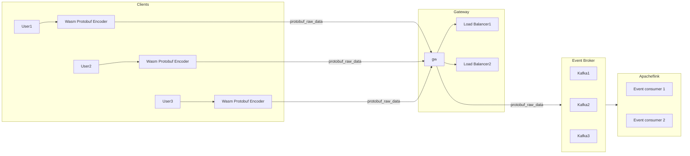

# Global Metrics Ingestion Engine

## Overview
Engine to collect realtime telemetry - cpu, memory, custom application metric from millions of cliens running worldwide.

## Requirements

### Traffic Scale
<ul>
<li> 50billion request per day distributed globally. </li>
<li> Non uniform traffic. Assumption: standard 3:1 during peak or high traffic hours </li>
</ul>    

### Capacity Estimation
1. Client side ingestion api call < 50ms globally
2. Computing occurs at edge points-of-presence (POPs) using lightweight wasm/V8
3. Memory limit is strictly 50MB per worker execution context. No long running background processes allowed on the edge nodes
4. Zero data loss
5. Resileiancy against regional network partitions
###
4. Architecture Diagram

5. Components
6. Data Flow
7. Database Design
8. API Design
9. Scaling Strategy
10. Reliability & Disaster Recovery
11. Security    
12. Monitoring
13. Deployment Architecture
14. Technology Stack
15. Risks & Trade-offs
16. Future Enhancements